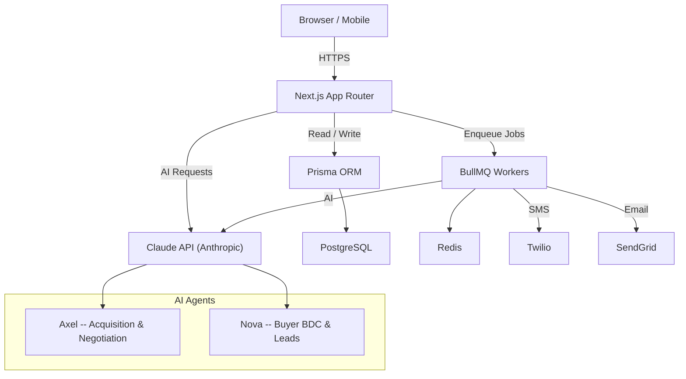

# Blacklight AI -- Revenue Operating System for Automotive Dealerships

Blacklight AI is an AI-powered revenue operating system built for automotive dealerships. It combines two specialized AI agents to automate and optimize the two highest-leverage functions in dealership operations: vehicle acquisition and buyer engagement.

- **Axel** -- Vehicle Acquisition & Negotiation Agent. Axel sources inventory from auctions, trade-ins, and private sellers, then handles price negotiation using real-time market data and configurable margin targets.
- **Nova** -- Buyer BDC & Lead Engagement Agent. Nova manages inbound and outbound lead engagement across SMS, email, and web chat, qualifying buyers and booking appointments with human sales staff.

Together, these agents give dealerships a 24/7 AI workforce that drives revenue on both sides of the transaction.

---

## Tech Stack

| Layer | Technology |
|---|---|
| Framework | Next.js 14+ (App Router) |
| Language | TypeScript |
| Styling | Tailwind CSS |
| ORM / Database | Prisma + PostgreSQL |
| AI | Anthropic Claude API |
| Job Queue | BullMQ + Redis |
| SMS | Twilio |
| Email | SendGrid |
| Auth | NextAuth.js |
| Storage | S3-compatible object storage |
| Deployment | Docker / Docker Compose |

---

## Prerequisites

- **Node.js** 20+
- **Docker** and **Docker Compose**
- **Anthropic API key** (Claude)
- **Twilio** account (Account SID, Auth Token, phone number)
- **SendGrid** account (API key)

---

## Quick Start

```bash
# 1. Clone the repository
git clone https://github.com/your-org/blacklight-ai.git
cd blacklight-ai

# 2. Copy the example environment file and fill in your keys
cp apps/web/.env.example apps/web/.env

# 3. Start PostgreSQL and Redis via Docker Compose
docker-compose up -d

# 4. Install dependencies
cd apps/web && npm install

# 5. Run database migrations
npx prisma migrate dev

# 6. Seed the database with demo data
npx prisma db seed

# 7. Start the development server
npm run dev

# 8. Open your browser
#    http://localhost:3000

# 9. Log in with demo credentials
#    Email:    demo@blacklight.ai
#    Password: blacklight-demo
```

---

## Architecture



---

## Project Structure

```
blacklight-ai/
├── apps/
│   └── web/                    # Next.js application
│       ├── app/                # App Router pages and layouts
│       │   ├── (auth)/         # Authentication routes
│       │   ├── (dashboard)/    # Dashboard routes
│       │   └── api/            # API route handlers
│       ├── components/         # Shared React components
│       ├── lib/                # Utilities, AI agent logic, services
│       ├── prisma/             # Schema, migrations, seed script
│       └── public/             # Static assets
├── docker-compose.yml          # PostgreSQL + Redis services
├── .github/
│   ├── workflows/ci.yml        # CI pipeline
│   └── PULL_REQUEST_TEMPLATE.md
├── .gitignore
├── LICENSE
└── README.md
```

---

## Key Features

- **AI-Powered Vehicle Acquisition** -- Axel evaluates deals, calculates margins, and negotiates pricing using Claude with access to market comps.
- **Automated Lead Engagement** -- Nova qualifies inbound leads and runs multi-step outbound sequences over SMS and email.
- **Unified Dashboard** -- Single pane of glass for inventory, leads, conversations, and agent activity.
- **Conversation Threads** -- Full audit trail of every AI-to-human and AI-to-AI interaction.
- **Role-Based Access Control** -- Admin, Manager, and Agent roles with granular permissions.
- **Real-Time Notifications** -- WebSocket-powered updates when agents take action or need human review.
- **Export & Reporting** -- CSV and PDF exports for inventory, leads, and performance metrics.
- **Multi-Dealership Support** -- Tenant-scoped data model supporting multiple rooftops.

---

## Environment Variables

| Variable | Description | Required |
|---|---|---|
| `DATABASE_URL` | PostgreSQL connection string | Yes |
| `NEXTAUTH_SECRET` | Secret for NextAuth session encryption | Yes |
| `NEXTAUTH_URL` | Canonical URL of the app | Yes |
| `ANTHROPIC_API_KEY` | Anthropic API key for Claude | Yes |
| `TWILIO_ACCOUNT_SID` | Twilio Account SID | Yes |
| `TWILIO_AUTH_TOKEN` | Twilio Auth Token | Yes |
| `TWILIO_PHONE_NUMBER` | Twilio phone number (E.164 format) | Yes |
| `SENDGRID_API_KEY` | SendGrid API key | Yes |
| `SENDGRID_FROM_EMAIL` | Verified sender email for SendGrid | Yes |
| `REDIS_URL` | Redis connection string | Yes |
| `S3_BUCKET` | S3 bucket name for file exports | No |
| `S3_REGION` | S3 bucket region | No |
| `S3_ACCESS_KEY` | S3 access key | No |
| `S3_SECRET_KEY` | S3 secret key | No |
| `NEXT_PUBLIC_APP_URL` | Public-facing app URL | Yes |

See `apps/web/.env.example` for a ready-to-copy template.

---

## Contributing

1. Fork the repository.
2. Create a feature branch: `git checkout -b feat/my-feature`.
3. Make your changes and ensure linting and tests pass:
   ```bash
   npm run lint
   npx tsc --noEmit
   npm run test
   ```
4. Commit with a clear message: `git commit -m "feat: add vehicle valuation endpoint"`.
5. Push and open a pull request against `main`.

Please follow the pull request template and include a test plan.

---

## License

This project is licensed under the [MIT License](./LICENSE).
